# cryptocurrency-exchange

### How to install?
1. Download repo
2. Make sure you have installed JDK, otherwise install it
3. Go to the project folder, open terminal and run following command
   - for Windows
   ```
   .\mvnw install
   ```
   - for Linux
   ```
   chmod u+x mvnw
   ./mvnw install
   ```
4. Go to the target folder, and run following command
   ```
   java -jar trading-platform-0.0.1-SNAPSHOT.jar
   ```

<hr>

The application simulates the cryptocurrency exchange. The user can create his account to build his portfolio. An inexperienced user can start his adventure with cryptocurrencies without losing his own money, and an experienced trader can compete with other users to be at the top of the ranking.
   
#### home page
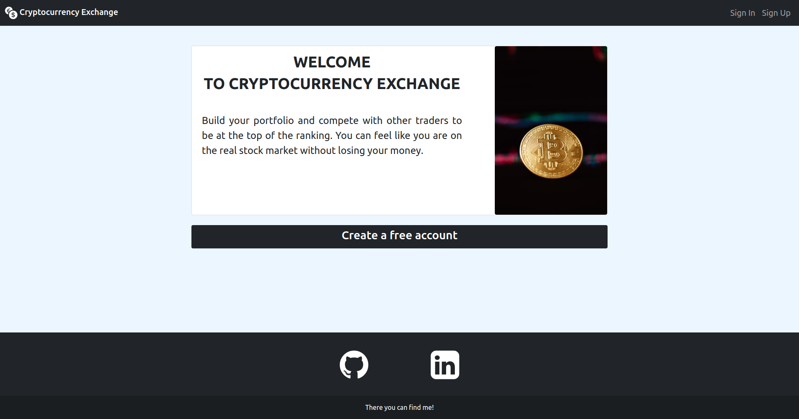
<hr>

#### registration page
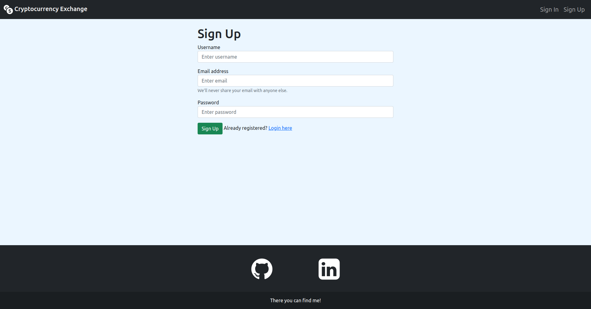
<hr>

#### verification page
> After succesful registration, the user receives an e-mail to activate the account. The generated token is valid for 24 hours.

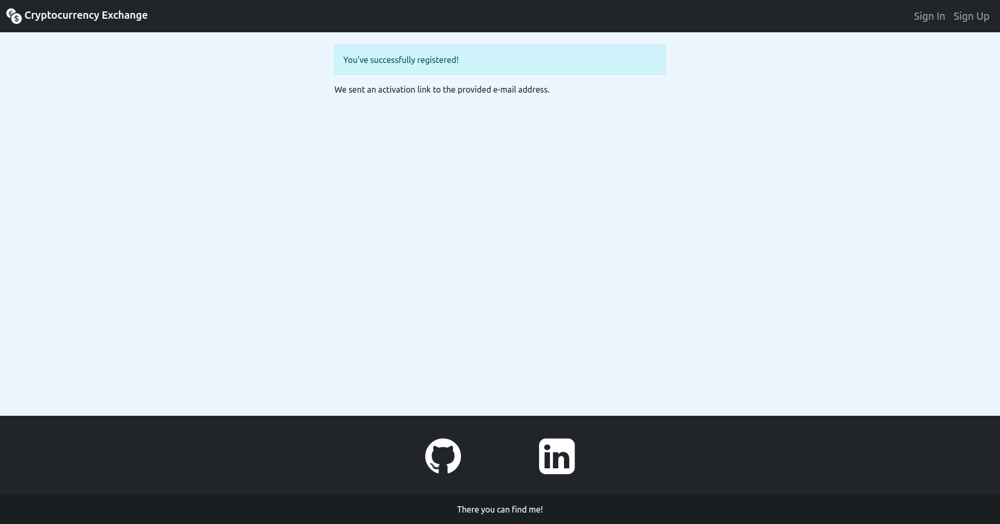
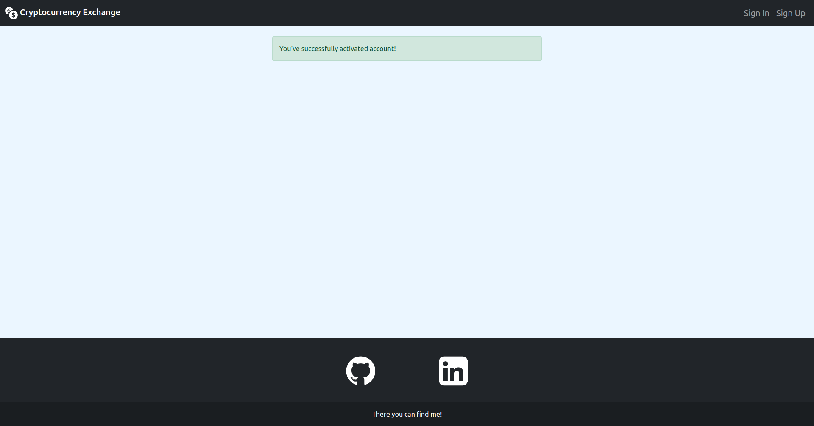
<hr>

#### login page
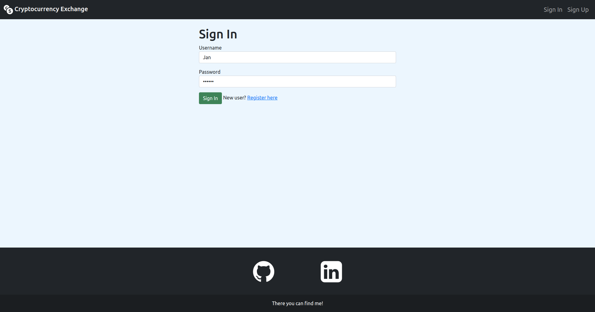
<hr>

#### wallet page
> The user can check the status of his portfolio - owned funds and cryptocurrencies.

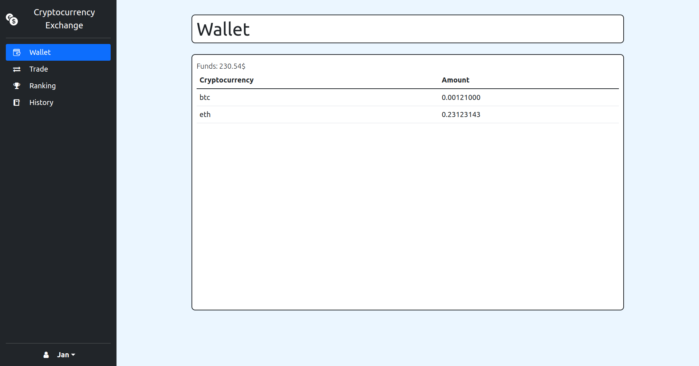
<hr>

#### trade page
> The user can check the available cryptocurrencies and their prices, and then choose the one he wants to trade.

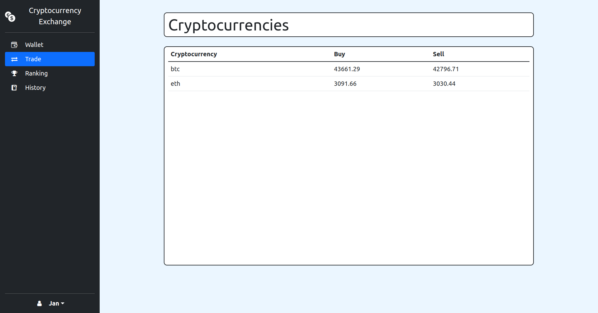
<hr>

#### trade cryptocurrency page
> The user enters the amount of the cryptocurrency he wants to sell or buy. If the given amounts are incorrect - the user does not have enough funds or cryptocurrencies, the button becomes disabled. Below the button, the profit or cost of the transaction is displayed, calculated on the basis of the entered amount values.

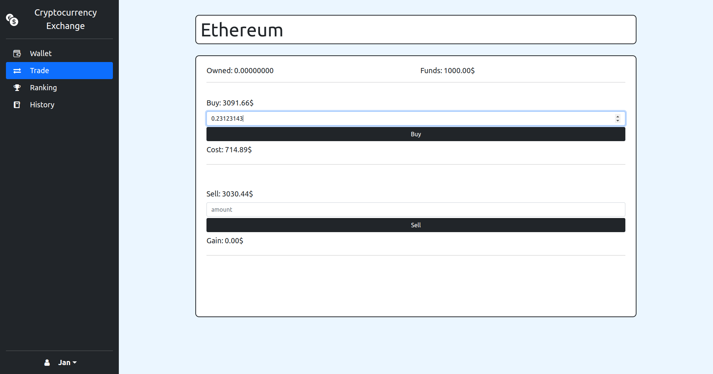
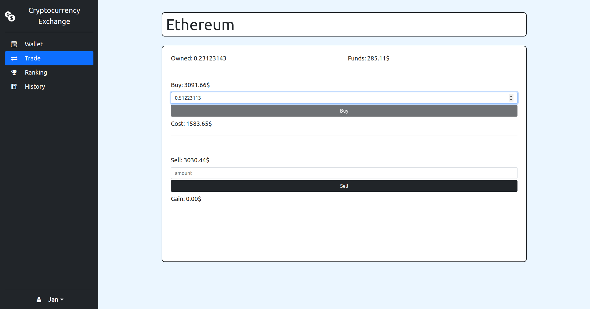
<hr>

#### ranking page
> Ranking of all active users.

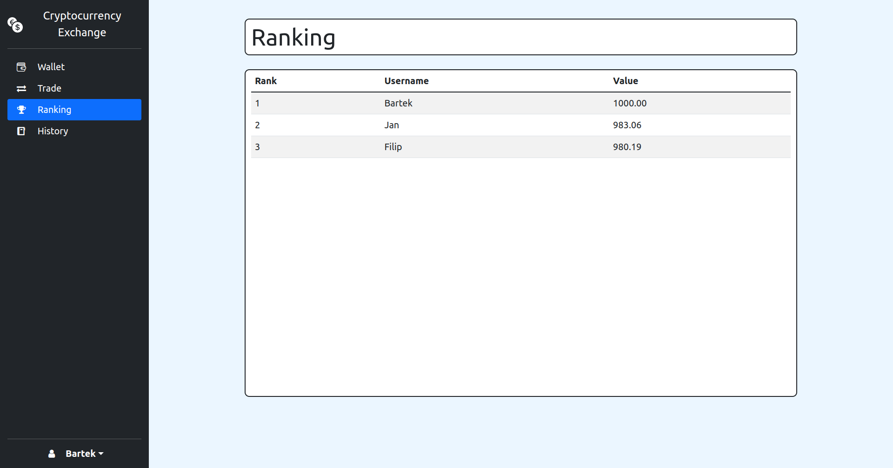
<hr>

#### history page
> The user can check the history of all his transactions.

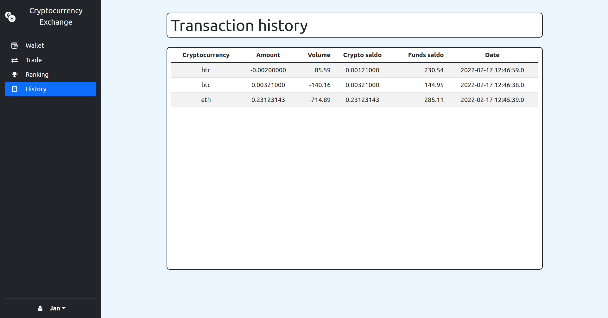
<hr>

#### settings page
> The user can change his password and e-mail address.

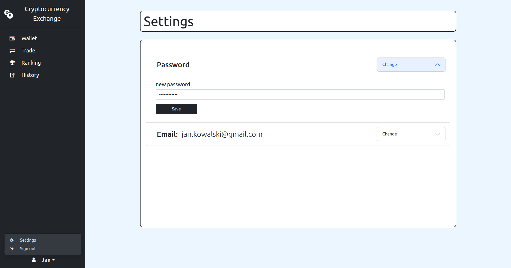
<hr>
